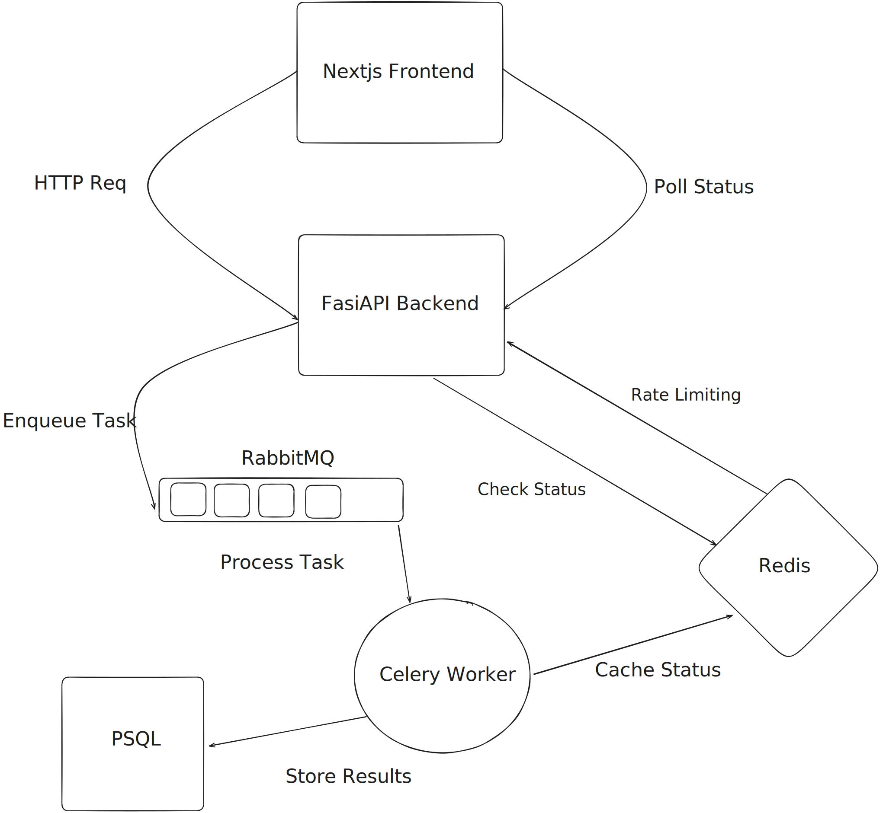
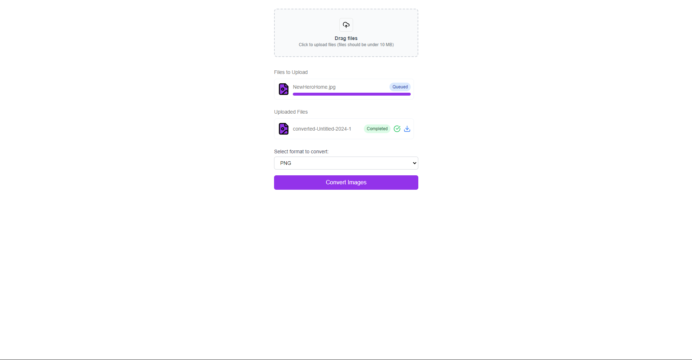

# Backend Polling Communication Architecture

An image processing system built with modern technologies such as FastAPI, Next.js, Redis, and Celery, demonstrating a polling system.

## HighLevel Architecture Diagram



## Screenshot


## Technical Architecture

### Backend Architecture
- **FastAPI Framework** - High-performance async web framework
- **Celery** - Distributed task queue for async image processing
- **RabbitMQ** - Message broker for task queue management
- **Redis** - In-memory cache for job status tracking
- **PostgreSQL** - Persistent storage with SQLAlchemy ORM
- **Alembic** - Database migration management

### Frontend Architecture 
- **Next.js 14** with App Router
- **TypeScript** for type safety
- **Tailwind CSS** for styling
- **Shadcn UI** components

### Infrastructure
- **Docker** containerization with multi-container setup
- **Docker Compose** for container orchestration

## Key Technical Features

### Backend Implementation
- Asynchronous request handling with FastAPI
- Rate limiting middleware using Redis
- Celery task queue for distributed image processing
- Redis caching layer for job status
- PostgreSQL for persistent job storage
- CORS middleware configuration
- Static file serving for uploads/converted images
- Environment-based configuration management

### Frontend Implementation
- TypeScript for enhanced type safety
- Real-time status polling
- Responsive UI with Tailwind CSS

### DevOps
- Containerized development environment
- Scalable service architecture

## Getting Started

### Prerequisites
- Docker and Docker Compose installed on your machine.

### Running the Application
```
# Clone repository
git clone https://github.com/Amaljith64/fastapi-nextjs-redis-polling

# Copy env and add your credentials
cp .env.template .env

# Start services
docker compose up -d --build

# Run database migrations
docker compose exec backend alembic upgrade head

```

### API Documentation
- OpenAPI documentation available at /docs

